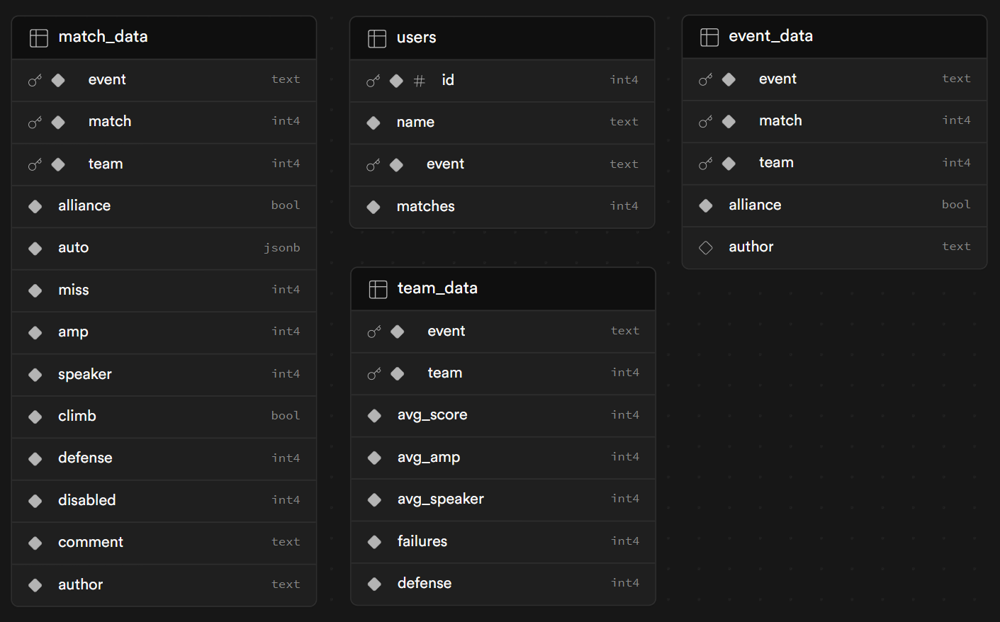
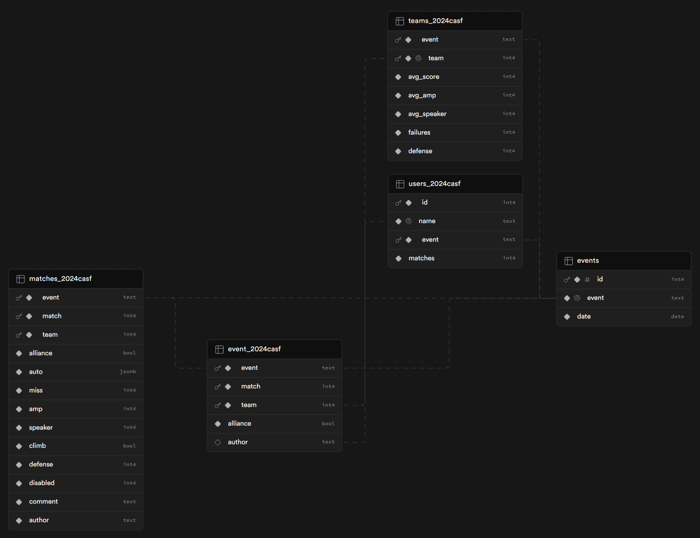

# Funkyscout

FRC 846's scouting app for the 2025-2026 season.
___

#### Preface

Funkyscout uses React with Typescript and Vite, along with Supabase for its database infrastructure because of its very generous free tier!! 

#### Development

Clone the repo and open a terminal window in your funkyscout folder, and run the following commands. Make sure you have node.js installed beforehand!

```
npm install
npm run dev
```

#### Data Storage

The [database](https://supabase.com/dashboard/project/ogjtjvjcrnmbkzowovvc) (Request access if you do not have access) is a PostgreSQL database hosted on Supabase. The database has four partitioned tables: `event`, `matches`, `teams`, and `users`. Every time a new competition needs to be scouted, a partition of each table is created. While each table is small so partitions won't have a big impact on speed, it gives us better organization and lets us use some other database features.



A table named `events` is not shown here, and it is a list of all events/competitions stored in the database, and is used as a reference to partition other tables.

The `event` (without an s) table contains match schedules and scouter shifts, where each row contains a match, the team playing, and the scouter responsible. The matches table is very similar to the event table, with the same structure plus many more columns for storing the scouting data. 

Now you might ask, why do we have two seperate tables for practically the same thing? That's a great question! We can, but I decided not to because I felt like it and its too late to go back. The other reason is the `event` table gives us a definitive reference for scouter shifts and match schedules, while the `matches` table allows more flexibility. An example of this flexibility is if a scouter who was not registered in `users` scouts a match or if someone is covering someone else's shift, the row for that particular match isn't already defined.

Now you might ask, why can't we just overwrite that row? That's a great question! We can, but we wouldn't have anything to check if the match and team is actually a real match and not just something the scouter made up, which is pretty important once the data needs to be analyzed! It's also just much nicer to organize the scouter shifts and match data into seperate tables.


